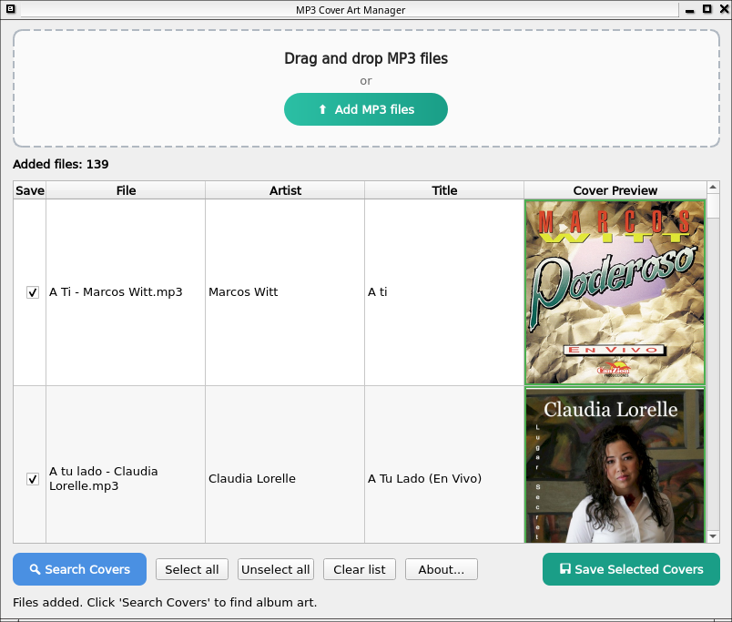

# Cover Finder

Este tutorial está disponible en español aquí:

[](README_ES.md)

A graphical application to search and add album art to MP3 files. Uses iTunes and Deezer APIs to automatically find cover art for your songs.

## Features

- **Drag and drop**: Simply drag your MP3 files into the application
- **Automatic search**: Searches for covers using iTunes and Deezer APIs
- **Preview**: Shows found covers before saving them
- **Existing cover detection**: Detects if an MP3 already has a cover and displays it
- **Smart selection**: Files with existing covers appear unchecked by default
- **Dynamic row height**: Rows adjust to cover size for better visualization

## Requirements

- Python 3.6 or higher
- PyQt6
- requests
- mutagen

## Installation

### Linux

#### Method 1: Run directly (recommended)

1. Make sure you have Python 3 and dependencies installed:
```bash
sudo apt update && sudo apt upgrade
sudo apt install python3-pyqt6 python3-requests python3-mutagen
```

2. Run the application:
```bash
python3 cover_finder.py
```




#### Method 2: Use pip (for developers)

1. Install dependencies:
```bash
pip install PyQt6 requests mutagen
```

2. Run the application:
```bash
python cover_finder.py
```

### Windows

1. Make sure you have Python installed and in PATH. Download it from [python.org](https://www.python.org/downloads/)

2. Open a terminal (CMD or PowerShell) and navigate to the directory where `cover_finder.py` is located

3. Install dependencies:
```bash
pip install PyQt6 requests mutagen
```

4. Run the application:
```bash
python cover_finder.py
```

Or if you have Python 3 specifically:
```bash
py cover_finder.py
```

### macOS

1. Make sure you have Python 3 installed. You can install it with Homebrew:
```bash
brew install python3
```

2. Install dependencies:
```bash
pip3 install PyQt6 requests mutagen
```

3. Run the application:
```bash
python3 cover_finder.py
```

## Usage

1. **Add MP3 files**:
   - Drag and drop MP3 files into the designated area
   - Or click the "⬆ Add MP3 files" button to select files

2. **View existing covers**:
   - Files that already have a cover are shown with the image and a green border
   - These files appear with the checkbox unchecked by default

3. **Search for covers**:
   - Click the "🔍 Search Covers" button to automatically search for covers
   - The program will search iTunes and Deezer for the best matches
   - Found covers will be displayed in the "Cover Preview" column

4. **Select what to save**:
   - Check or uncheck the checkboxes according to the covers you want to save
   - Use the "Select all" or "Unselect all" buttons to check/uncheck everything

5. **Save covers**:
   - Click "💾 Save Selected Covers" to save the selected covers to the MP3 files

## Notes

- The program uses a scoring system to find the best cover matches
- Table rows automatically adjust to cover size for better visualization
- You can resize the "Cover Preview" column by dragging its border
- The application opens maximized to take advantage of screen space

## License

This project is licensed under the GPL 3 License - see the [LICENSE](LICENSE) file for details.

## Credits

Developed by Washington Indacochea Delgado
